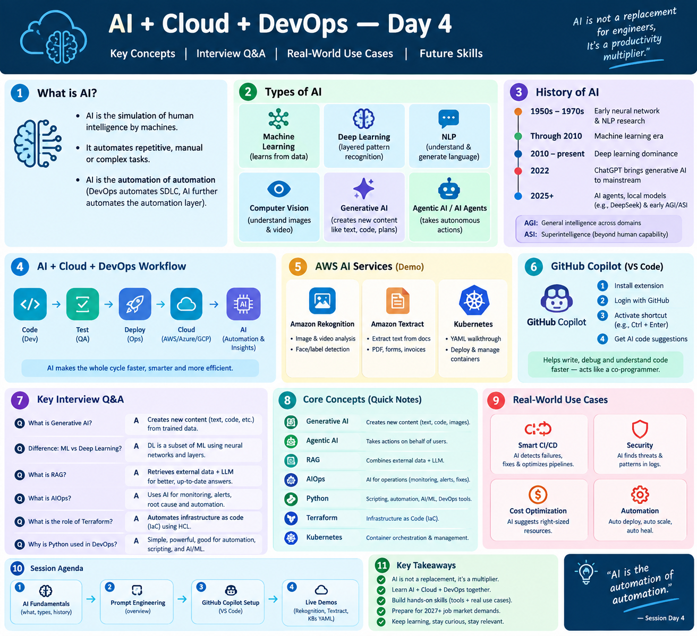

# Day 002 - DevOps Learning Log

## Topics Covered
- AI Ops (AIOps) and its role in modern DevOps
- Using artificial intelligence and machine learning to improve IT operations
- Monitoring, observability, automation, and faster incident response
- Applying AI-driven insights to improve reliability and efficiency

## Key Takeaways
- AIOps combines artificial intelligence, machine learning, and operational data to improve IT operations
- AI can help teams detect anomalies, identify root causes, and respond to incidents more quickly
- Automation reduces repetitive operational work and helps DevOps teams focus on delivery and reliability
- Effective AIOps depends on quality monitoring data, observability, and well-defined operational processes

☁️ **Create a VM on Google Cloud in 6 steps**

1️⃣ Compute Engine → Create Instance
2️⃣ Name it (e.g. `vmdemo`)
3️⃣ OS and Storage → pick Ubuntu
4️⃣ Networking → allow HTTP and HTTPS
5️⃣ Click Create
✅ VM is ready!

Save it for later 📌

## AIOps Reference

## Resources
- Day 2 learning image: [`AI_Ops.png`](./AI_Ops.png)
- [AIOps — Wikipedia](https://en.wikipedia.org/wiki/AIOps)

