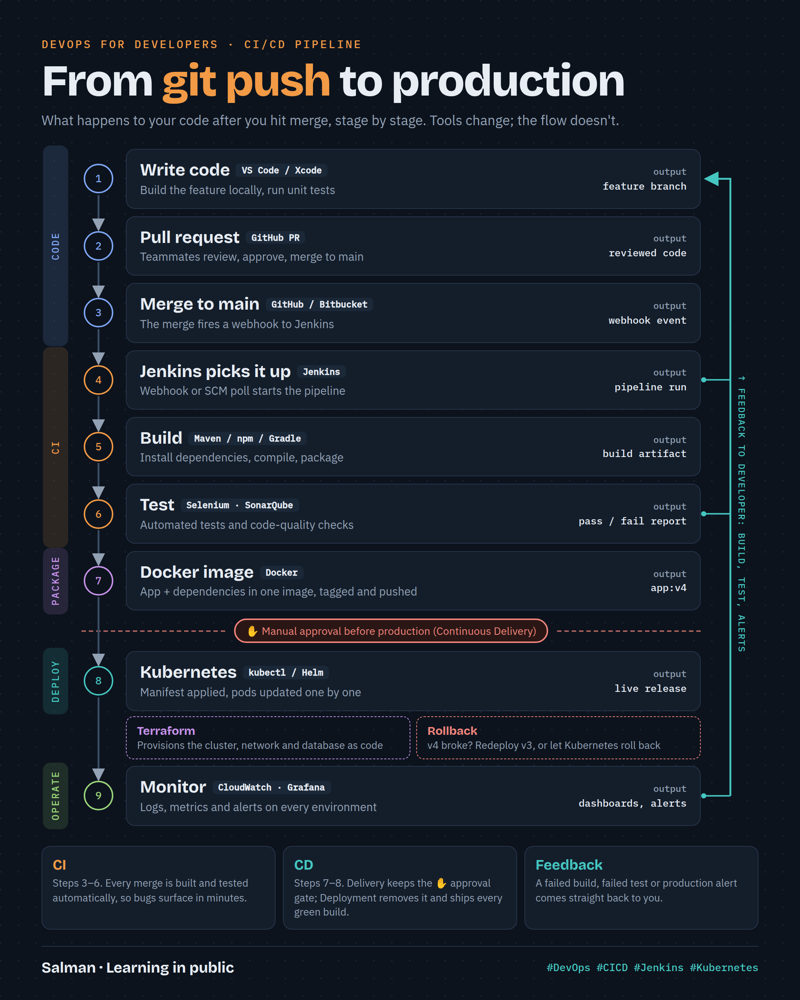
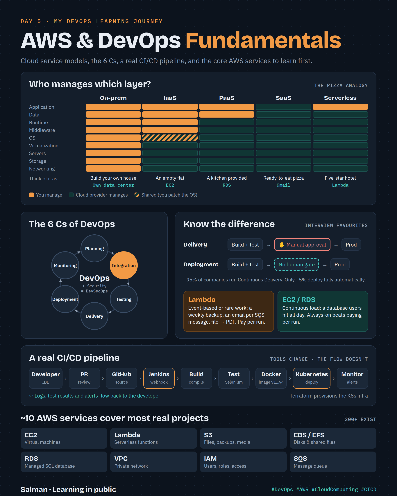

# Day 5 · AWS & DevOps Fundamentals

As a developer, I always wondered what happens after I push code to Git. Today it finally clicked. 🎉

## CI/CD pipeline: from git push to production

## AWS & DevOps fundamentals on one page

## Interactive version

Open [`index.html`](index.html) in a browser for the clickable version: service-model stack, 6 Cs loop, pipeline with failure scenarios, and 40 interview flashcards.

## Topics covered

- What AWS is, its history, and the ~10 core services (EC2, Lambda, S3, EBS/EFS, RDS, VPC, IAM, SQS)
- IaaS vs PaaS vs SaaS vs Serverless (the pizza analogy)
- When to use Lambda vs EC2/RDS
- Waterfall vs Agile vs DevOps
- The 6 Cs of DevOps; Continuous Delivery vs Continuous Deployment
- A real CI/CD pipeline: GitHub → Jenkins → Docker → Kubernetes → Monitoring, with Terraform
- 20 basic + 20 scenario-based interview questions
